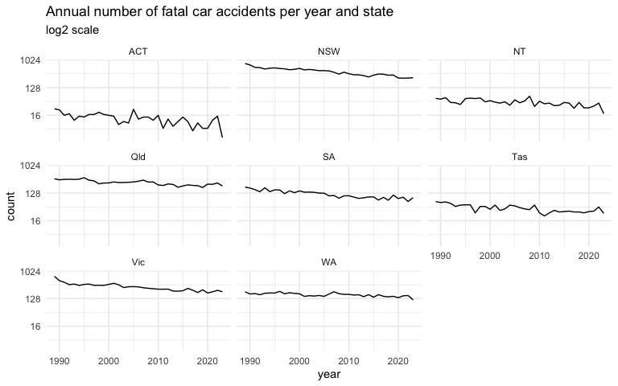
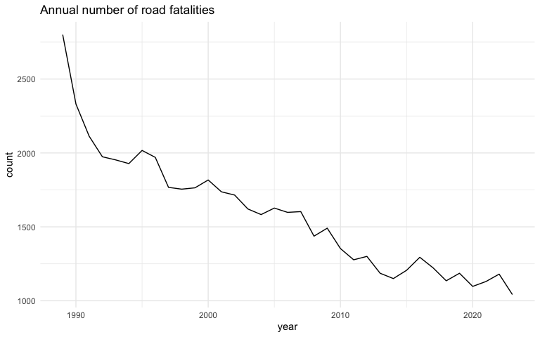

<!-- README.md is generated from README.Rmd. Please edit that file -->

# ozroaddeaths

<!-- badges: start -->
[](https://github.com/njtierney/ozroaddeaths/actions/workflows/R-CMD-check.yaml)
[](https://app.codecov.io/gh/njtierney/ozroaddeaths)
<!-- badges: end -->

ozroaddeaths is a package that pulls data from the Australian Road
Deaths Database, run by the Bureau of Infrastructure, Transport and
Regional Economics (BITRE). This provides basic details of road
transport crash fatalities in Australia as reported by the police each
month to the State and Territory road safety authorities. The details
provided in the database fall into two groups:

1.  The circumstances of the crash, for example, date, location, crash
    type

2.  Some details regarding the persons killed, for example, age, gender
    and road user group.

## Installation

You can install ozroaddeaths from github with:

``` r
# install.packages("pak")
pak::pak("njtierney/ozroaddeaths")
```

This data is taken from the Australian Road Deaths Database, which
provides basic details of road transport crash fatalities in Australia
as reported by the police each month to the State and Territory road
safety authorities, obtained from:
<https://data.gov.au/dataset/ds-dga-5b530fb8-526e-4fbf-b0f6-aa24e84e4277/details?q=crash>

Details provided in the database fall into two groups:

- the circumstances of the crash, for example, date, location, crash
  type

- some details regarding the persons killed, for example, age, gender
  and road user group.

The fatality data is updated every month. The heavy vehicle flags (for
articulated truck, heavy rigid truck and bus involvement) are only
updated each quarter, and are current to within two months. Information
for heavy rigid truck involvement in crashes earlier than 2004 is
incomplete. There is no day of the month for the data, so we have
imputed this as the first of the month.

## Package Author’s Notes

Data was available at URL as at 13th December 2019. Data is imported
into R and cleaned by removing redundant date columns and transforming
into a tidy format.

### Indemnity Statement:

The Bureau of Infrastructure, Transport and Regional Economics has taken
due care in preparing this information. However, noting that data have
been provided by third parties, the Commonwealth gives no warranty as to
the accuracy, reliability, fitness for purpose, or otherwise of the
information.

Copyright

© Commonwealth of Australia, 2024

This work is copyright and the data contained in this publication should
not be reproduced or used in any form without acknowledgement.

## Import data from the BITRE website into R

``` r
library(ozroaddeaths)
library(dplyr)
library(ggplot2)
library(lubridate)
library(ggridges)
```

``` r
crashes <- oz_road_fatal_crash() 
fatalities <- oz_road_fatalities()
```

## Variables available

### Crashes

``` r
knitr::kable(dplyr::as_data_frame(names(crashes)))
#> Warning: `as_data_frame()` was deprecated in tibble 2.0.0.
#> ℹ Please use `as_tibble()` (with slightly different semantics) to convert to a
#>   tibble, or `as.data.frame()` to convert to a data frame.
#> This warning is displayed once every 8 hours.
#> Call `lifecycle::last_lifecycle_warnings()` to see where this warning was
#> generated.
```

| value             |
|:------------------|
| crash_id          |
| n_fatalities      |
| month             |
| year              |
| weekday           |
| time              |
| state             |
| crash_type        |
| bus               |
| heavy_rigid_truck |
| articulated_truck |
| speed_limit       |
| date              |
| date_time         |

``` r
knitr::kable(head(crashes))
```

| crash_id | n_fatalities | month | year | weekday | time | state | crash_type | bus | heavy_rigid_truck | articulated_truck | speed_limit | date | date_time |
|---:|---:|---:|---:|:---|:---|:---|:---|:---|:---|:---|---:|:---|:---|
| 20233052 | 1 | 10 | 2023 | Saturday | 23:00:00 | Qld | Single | No | No | No | 70 | 2023-10-01 | 2023-10-01 23:00:00 |
| 20233053 | 1 | 10 | 2023 | Sunday | 16:00:00 | Qld | Multiple | No | No | No | 60 | 2023-10-01 | 2023-10-01 16:00:00 |
| 20231113 | 1 | 10 | 2023 | Saturday | 00:05:00 | NSW | Single | No | No | No | 100 | 2023-10-01 | 2023-10-01 00:05:00 |
| 20237008 | 1 | 10 | 2023 | Friday | NA | NT | Single | No | No | No | NA | 2023-10-01 | 2023-10-01 00:00:00 |
| 20234067 | 1 | 10 | 2023 | Sunday | 22:28:00 | SA | Single | No | No | No | 60 | 2023-10-01 | 2023-10-01 22:28:00 |
| 20235100 | 1 | 10 | 2023 | Sunday | 20:43:00 | WA | Single | No | No | No | NA | 2023-10-01 | 2023-10-01 20:43:00 |

### Fatalities

``` r
knitr::kable(dplyr::as_data_frame(names(fatalities)))
```

| value             |
|:------------------|
| crash_id          |
| month             |
| year              |
| weekday           |
| time              |
| state             |
| crash_type        |
| bus               |
| heavy_rigid_truck |
| articulated_truck |
| speed_limit       |
| road_user         |
| gender            |
| age               |
| date              |
| date_time         |

``` r
knitr::kable(head(fatalities))
```

| crash_id | month | year | weekday | time | state | crash_type | bus | heavy_rigid_truck | articulated_truck | speed_limit | road_user | gender | age | date | date_time |
|---:|---:|---:|:---|:---|:---|:---|:---|:---|:---|---:|:---|:---|---:|:---|:---|
| 20237008 | 10 | 2023 | Friday | NA | NT | Single | No | No | No | NA | Driver | Female | 24 | 2023-10-01 | 2023-10-01 00:00:00 |
| 20234009 | 10 | 2023 | Saturday | 03:00:00 | SA | Single | No | No | No | 100 | Driver | Male | 22 | 2023-10-01 | 2023-10-01 03:00:00 |
| 20233087 | 10 | 2023 | Saturday | 03:00:00 | Qld | Single | No | No | No | 80 | Driver | Male | 19 | 2023-10-01 | 2023-10-01 03:00:00 |
| 20233149 | 10 | 2023 | Sunday | 03:00:00 | Qld | Single | No | No | No | 60 | Passenger | Male | 37 | 2023-10-01 | 2023-10-01 03:00:00 |
| 20233190 | 10 | 2023 | Sunday | 03:00:00 | Qld | Multiple | No | No | No | 100 | Motorcycle rider | Male | 35 | 2023-10-01 | 2023-10-01 03:00:00 |
| 20233052 | 10 | 2023 | Saturday | 23:00:00 | Qld | Single | No | No | No | 70 | Driver | Female | 32 | 2023-10-01 | 2023-10-01 23:00:00 |

### Plot crashes by year

``` r
crash_plot <- ggplot(crashes,
                     aes(x = year,
                         fill = year)) +
  geom_line(stat = "count") +
  theme_minimal() +
  ggtitle("Annual number of fatal car accidents per year")

crash_plot
#> Warning: The following aesthetics were dropped during statistical transformation: fill.
#> ℹ This can happen when ggplot fails to infer the correct grouping structure in
#>   the data.
#> ℹ Did you forget to specify a `group` aesthetic or to convert a numerical
#>   variable into a factor?
```

<!-- -->

### Plot crashes by year and state

``` r
crash_plot +
  scale_y_continuous(trans = "log2") +
  facet_wrap(~state) +
   ggtitle("Annual number of fatal car accidents per year and state",
           subtitle = "log2 scale" )
#> Warning: The following aesthetics were dropped during statistical transformation: fill.
#> ℹ This can happen when ggplot fails to infer the correct grouping structure in
#>   the data.
#> ℹ Did you forget to specify a `group` aesthetic or to convert a numerical
#>   variable into a factor?
#> The following aesthetics were dropped during statistical transformation: fill.
#> ℹ This can happen when ggplot fails to infer the correct grouping structure in
#>   the data.
#> ℹ Did you forget to specify a `group` aesthetic or to convert a numerical
#>   variable into a factor?
#> The following aesthetics were dropped during statistical transformation: fill.
#> ℹ This can happen when ggplot fails to infer the correct grouping structure in
#>   the data.
#> ℹ Did you forget to specify a `group` aesthetic or to convert a numerical
#>   variable into a factor?
#> The following aesthetics were dropped during statistical transformation: fill.
#> ℹ This can happen when ggplot fails to infer the correct grouping structure in
#>   the data.
#> ℹ Did you forget to specify a `group` aesthetic or to convert a numerical
#>   variable into a factor?
#> The following aesthetics were dropped during statistical transformation: fill.
#> ℹ This can happen when ggplot fails to infer the correct grouping structure in
#>   the data.
#> ℹ Did you forget to specify a `group` aesthetic or to convert a numerical
#>   variable into a factor?
#> The following aesthetics were dropped during statistical transformation: fill.
#> ℹ This can happen when ggplot fails to infer the correct grouping structure in
#>   the data.
#> ℹ Did you forget to specify a `group` aesthetic or to convert a numerical
#>   variable into a factor?
#> The following aesthetics were dropped during statistical transformation: fill.
#> ℹ This can happen when ggplot fails to infer the correct grouping structure in
#>   the data.
#> ℹ Did you forget to specify a `group` aesthetic or to convert a numerical
#>   variable into a factor?
#> The following aesthetics were dropped during statistical transformation: fill.
#> ℹ This can happen when ggplot fails to infer the correct grouping structure in
#>   the data.
#> ℹ Did you forget to specify a `group` aesthetic or to convert a numerical
#>   variable into a factor?
```

<!-- -->

### Fatalities by year

``` r
fatality_plot <- fatalities %>%
  mutate(year = lubridate::year(date_time)) %>%
  ggplot(aes(x =  year, 
             fill = year)) +
  geom_line(stat = "count") +
  theme_minimal() +
  ggtitle("Annual number of road fatalities")

fatality_plot
#> Warning: The following aesthetics were dropped during statistical transformation: fill.
#> ℹ This can happen when ggplot fails to infer the correct grouping structure in
#>   the data.
#> ℹ Did you forget to specify a `group` aesthetic or to convert a numerical
#>   variable into a factor?
```

<!-- -->

``` r
fatality_plot <- fatalities %>%
  filter(gender != "Unspecified") %>%
  mutate(year = lubridate::year(date_time)) %>%
  ggplot(aes(x = age, 
             fill = gender )) +
  geom_density() +
  facet_wrap(~gender) +
  theme_minimal() +
  ggtitle("Distribution of road fatalities by age 1989 to 2017")

fatality_plot
#> Warning: Removed 98 rows containing non-finite outside the scale range
#> (`stat_density()`).
#> Warning: Groups with fewer than two data points have been dropped.
#> Warning in max(ids, na.rm = TRUE): no non-missing arguments to max; returning
#> -Inf
```

<!-- -->
